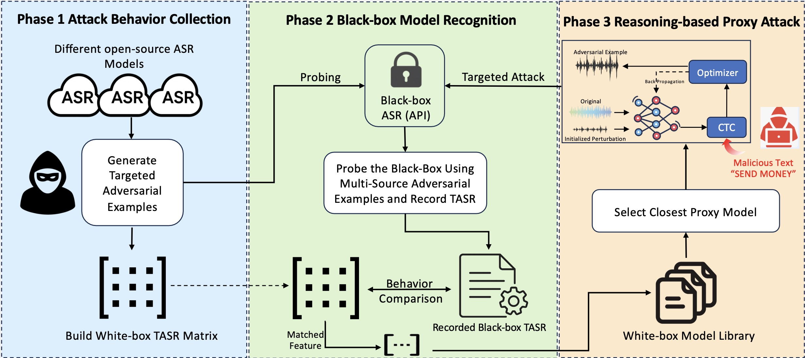

# Wav2PWN Project Overview
Wav2PWN leverages the transferability of adversarial examples across self-supervised ASR models to infer the architecture of a target black-box model and launch targeted attacks. We first construct a behavioral response matrix that captures the attack success rates and transferability characteristics among multiple white-box SSL models (e.g., Wav2Vec2, HuBERT, Conformer). By comparing how a set of adversarial examples behave on the unknown black-box system against this reference matrix, we infer the most likely architecture of the target model. Once the closest white-box proxy model is identified, Wav2PWN generates targeted adversarial audio samples using it, achieving highly effective black-box attacks with minimal query requirements.




# How to Run
## Download LibriSpeech Dataset
We use the LibriSpeech dataset as the original clean speech dataset, so before running the program, you need to download the LibriSpeech dataset first. We recommend using the LibriSpeech test-clean subset.

🔗 Download Link
Official site: http://www.openslr.org/12

Recommended subset: test-clean.tar.gz

After this step, your directory structure should look like:

```
Wav2PWN-Project/
├── LibriSpeech/
│ ├── test-clean/
│ └── ...
```

## 📥 Download Results

You can access our generated adversarial examples for eight test models from the link below: (Because the result files are too large, we store our test results in Google Drive.)

🔗 [Download Result.zip from Google Drive]([https://drive.google.com/file/d/your_file_id/view?usp=sharing](https://drive.google.com/file/d/1PdKeUzuYpdTGFHOf4KX0ORmjg_0-Gy1O/view?usp=drive_link))

 After downloading, unzip the file and place the <code>Result/</code> folder into the root of the project: 
```
Wav2PWN-Project/
├── Result/
│   ├── 84-121123-0005_perturbed.wav
│   ├── 84-121123-0005_pred.txt
│   └── transcription_log.csv
```

## Evaluation
After downloading the result files and placing them in the Result/ folder, you can evaluate the adversarial examples by running the corresponding model scripts located in the **test_eval/** directory. Each script loads a specific ASR model and outputs the transcription results to help assess the effectiveness of the attack.

## Generate New Adversarial Audio Example
If you wish to generate your own adversarial audio sample, you can use the provided generate_adversarial.py script. This script allows you to freely choose a target ASR model and generate a single adversarial example.

The example below demonstrates how to configure attack parameters and specify the model using Wav2Vec2-large-960h:

```python

import torch
from transformers import Wav2Vec2ForCTC, Wav2Vec2Processor

TARGET_TEXT = "HELLO WORLD"
EPSILON = 0.05  # Initial perturbation strength
lr = 0.001
total_steps = 1000
rw = 0.1  # Regularization weight
DEVICE = "cuda" if torch.cuda.is_available() else "cpu"

# Load model and processor
name = "Facebook/wav2vec2-large-960h"
model = Wav2Vec2ForCTC.from_pretrained(name)
processor = Wav2Vec2Processor.from_pretrained(name)
model.to(DEVICE)

```

This single-sample generation is designed for quick testing and debugging of attack parameters.
To perform batch adversarial generation and evaluation, please refer to the scripts in the **Different_model_batch_generate/** directory.

## Automatically Generate Multiple Adversarial Samples in Batches
To generate multiple adversarial examples in batch, use the scripts provided in the **Different_model_batch_eval/** directory. This folder contains 8 different SSL-based ASR model configurations. After setting your desired target transcription, simply run the corresponding script.

Each script will automatically:

Randomly select clean speech samples from the LibriSpeech/ dataset

Apply the adversarial attack using the selected model

Save the perturbed audio and transcription results to Result/

You can customize the target phrase, attack strength (ε), and number of optimization iterations to suit your experimental needs.
